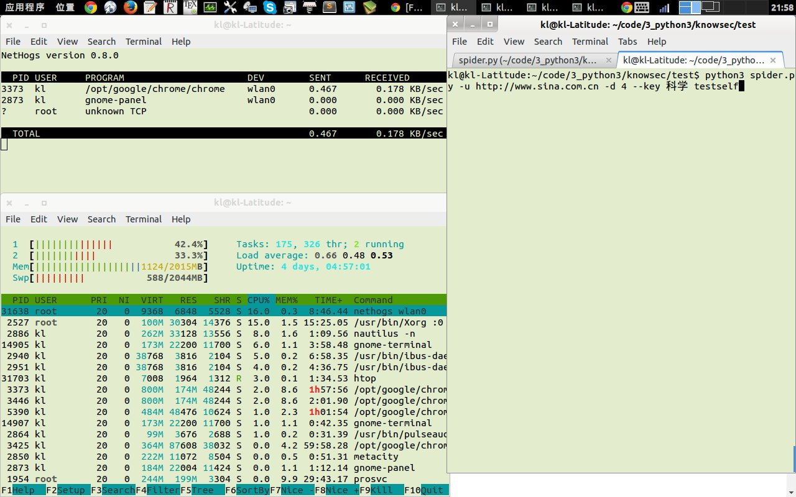
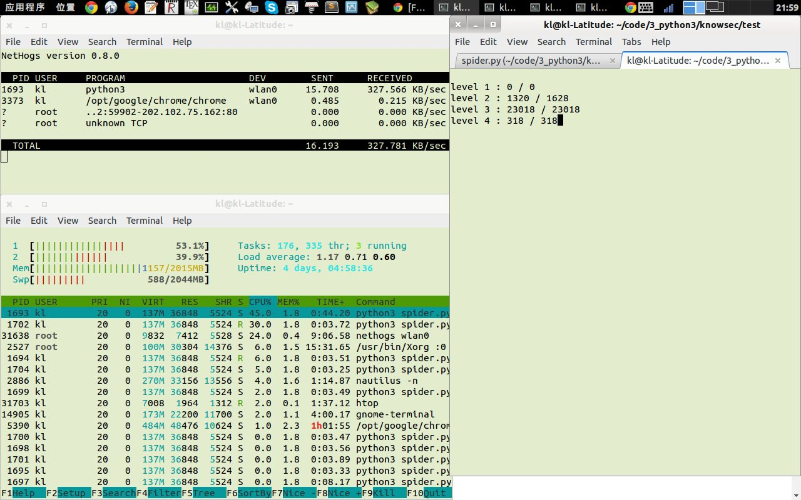

*Author: littlethunder* *mail:<kingthunder2004@aliyun.com>*

##基本要求
使用python编写一个网站爬虫程序，支持参数如下：
<code>
python3 spider.py -u url -d deep -f logfile -l loglevel(1-5)  --testself -thread number --dbfile  filepath  --key=”HTML5”
</code>

####参数说明：

-u 指定爬虫开始地址

-d 指定爬虫深度

--thread 指定线程池大小，多线程爬取页面，可选参数，默认10

--dbfile 存放结果数据到指定的数据库（sqlite）文件中

--key 页面内的关键词，获取满足该关键词的网页，可选参数，默认为所有页面

-l 日志记录文件记录详细程度，数字越大记录越详细，可选参数，默认spider.log

--testself 程序自测，可选参数

 

####功能描述：

1. 指定网站爬取指定深度的页面，将包含指定关键词的页面内容存放到sqlite3数据库文件中
2. 程序在屏幕上打印进度信息
3. 支持线程池机制，并发爬取网页
4. 代码需要详尽的注释
5. 需要自己实现线程池

##基本说明
1. 采用PEP8风格；
2. 采用线程池，在初始化线程池时创建线程，运行中不销毁线程，分配任务后从线程池中取出线程执行，完成后再放回线程池中，最后主程序运行完成后销毁全部线程；
3. 优化主线程，防止重复抓取相同链接，并根据文件md5值判断是否有同名但内容不同的文件；
4. 采用lxml网页解析模块；
5. 主进程进度显示采用curses
5. 自测模块test.py用来测试爬取的HTML页面是否有重复，指定关键词时在数据库中查找；没有指定关键词时在本地目录下查找，进度显示采用[progressbar-python3](https://github.com/coagulant/progressbar-python3)

##测试情况统计
测试运行命令是：<code>python3 spider.py -u http://www.sina.com.cn -d 3 -l 4 --key 科技</code>

测试使用工具：nethogs、htop。

默认在本目录下生成：

* spider.db: 数据库文件，保存含有关键词“科技”的网页
* spider.log: 日志文件，第四等级，很详细。

####总共URL数量共158238个，15万条的量级：

* 第一层：1
* 第二层：1610
* 第三层：156627

####系统网络、CPU、内存占用情况：

* 带宽占用：最高13.8Mbps，最低185.6bps，平均6Mbps。校园网在不同时间段由于使用人数不同会造成较大波动。
* CPU占用：0% 大部分时间是线程发出请求等待响应，基本不占用CPU时间
* 内存占用：默认开10个线程，每个线程平均占用8%，共占用80%左右，去掉chrome等其他占用内存的程序，spider.py相当于占满了内存。

##运行情况截图：

##v0.4更新说明：

* 改进格式
* 改进异常处理
* 把urls（保存url，防止下载同名url）和fileMD5（保存文件md5值，防止不同名相同内容重复下载）两个list改成set，查询效率提升为O(1)
